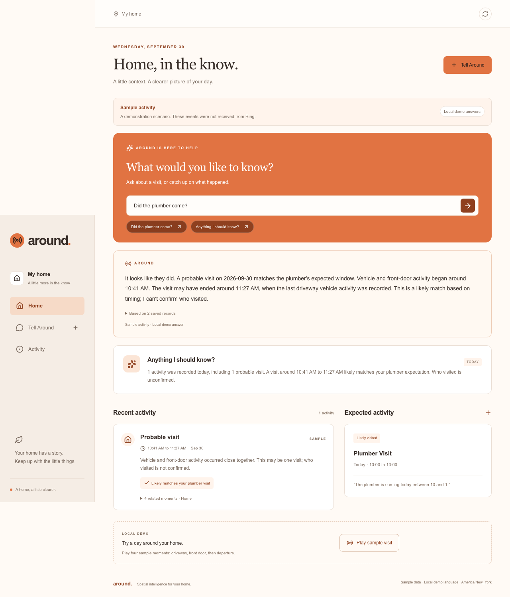

# Around

**Spatial intelligence for your home.**

Around helps homeowners connect expected activities with recorded activity. Tell Around who you are expecting and when, then ask what happened. This local, single-home prototype focuses on expected visits and short activity briefings.

[Watch the 118-second demo](https://youtu.be/3w68n80gRA8) · [Run the judge walkthrough](docs/JUDGE-GUIDE.md) · [Evidence matrix](SUBMISSION-EVIDENCE.md) · [Technical architecture](TECHNICAL-ARCHITECTURE.md)

## The experience

Tell Around, “The plumber is coming today between 10 and 1.” In the sample scenario, four driveway and front-door moments become one probable visit. Around connects its timing with the saved expectation. Ask “Did the plumber come?” and it gives qualified arrival and possible departure estimates, with identity unconfirmed. “Anything I should know?” summarizes stored activity and expectations for today.



*Credential-free sample screenshot, using local demo answers. These events were not received from Ring. The published video separately shows saved Bedrock answers and actual Ring integration evidence.*

## Implemented features

- Tell Around saves a same-day expected visit with a person or service, date and time window.
- Ring discovery/history ingestion normalizes supported events and persists them locally. Signed webhook ingestion is implemented and contract-tested.
- Activity grouping connects related moments; expectation matching compares probable visits with saved windows.
- Ask Around answers an expected-visit question or provides a daily briefing, with source labels and expandable evidence.
- Separate sample and Ring databases, visible provider errors and idempotent ingestion keep the demonstration repeatable.

Delivery confirmation, visitor recognition, voice input, notifications and home controls are planned for future releases. See [the executive summary](EXECUTIVE-SUMMARY.md) for the wider product roadmap.

## Evidence at a glance

| Capability | What has been observed |
| --- | --- |
| Official Ring runtime | Around retrieved one Playground device and three live-view requests, then stored and displayed them. The newest record is September 30, 2026 at 10:54 AM Eastern. |
| Positive multi-device visit | Four labeled sample events form one probable visit and likely expectation match. Live classified Ring detections have not validated this path. |
| Bedrock runtime | Actual app-side Nova Micro calls parsed expectations, answered from real Ring records and generated qualified answers from sample activity. |
| Webhooks and configured devices | Implemented and tested with mocked transport and official-shaped payloads; live webhook delivery and two physical devices remain unverified. |
| Video | Approved 118.3-second edit with separate takes and labeled stills. It shows saved sample answers, official Playground playback and an actual sync result. |

The public source is [thecoser/around](https://github.com/thecoser/around), MIT. The video is public on Praxais Studios. Devpost submission is pending. Detailed claim status and current local verification are in [SUBMISSION-EVIDENCE](SUBMISSION-EVIDENCE.md) and [SUBMISSION-CHECKLIST](SUBMISSION-CHECKLIST.md).

## Run locally

Requires Node.js 24 or newer; verified with 24.12.0. SQLite is provided by Node and currently emits an experimental warning. No separate database service is needed.

```sh
npm ci
npm run build
npm run demo:sample
```

Open http://127.0.0.1:3001. Confirm **Sample activity** and **Local demo answers**. This launcher overrides inherited provider modes and starts a fresh database each time. It makes no Ring or Bedrock request and preserves earlier databases.

1. Choose **Tell Around**, enter the plumber sentence above and save once.
2. Choose **Play sample visit**. Expect four events, one probable visit and a likely plumber match.
3. Ask **Did the plumber come?** Expect estimates of 10:41 AM and 11:27 AM, with identity unconfirmed.
4. Ask **Anything I should know?** and inspect the evidence.
5. Reload, then replay. Records persist and events do not duplicate.

The sample is accelerated, so event timestamps can be later than the current clock. Duplicate expectations deliberately create ambiguity. Stop and restart the sample launcher for a fresh rehearsal. `AROUND_DEMO_PORT=3002 npm run demo:sample` selects another local port.

For development use `npm run dev` on port 3000. Provider configuration in `.env.local` applies to normal development/start commands. Use `npm run demo:sample` for a guaranteed credential-free walkthrough.

## Architecture and event flow

The React interface calls Next.js server routes. A Ring API adapter or explicit sample adapter produces normalized events. SQLite transactions deduplicate and store events, rebuild grouped activities and update expectation matches. Answer code constructs evidence-backed statements; Bedrock interprets language and selects validated statements when enabled.

| Responsibility | Code |
| --- | --- |
| Home, Tell, Activity, Ask, source labels | [src/app/page.tsx](src/app/page.tsx) |
| Official discovery/history and webhook normalization | [src/lib/ring/api.ts](src/lib/ring/api.ts) |
| Sample devices and four-event visit | [src/lib/ring/fixture.ts](src/lib/ring/fixture.ts) |
| Persistence, transactions, deduplication and rebuilding | [src/lib/db.ts](src/lib/db.ts) |
| Grouping and matching | [src/lib/activity.ts](src/lib/activity.ts) |
| Expectation parsing, question interpretation, facts and Bedrock calls | [src/lib/ai.ts](src/lib/ai.ts) |

The [architecture brief](TECHNICAL-ARCHITECTURE.md) includes the diagram, route responsibilities, data model and exact call flow. No images or video are analyzed by Around.

## Ring integration

**Runtime entry point:** `POST /api/ring/sync` calls `syncRing()` in `src/lib/ring/api.ts` when `RING_MODE=ring`. It makes authenticated requests to `https://api.amazonvision.com/v1/devices` and `/v1/history/devices/{id}/events`. Pagination stays on the official origin, rejects redirects and is bounded to 20 pages per query. The full sync is collected before transactional ingestion; failures save no partial sync and do not switch to fixtures.

Supported normalized records include human/person motion, vehicle motion, generic motion, doorbell presses and `on_demand` live-view requests. Unsupported event types are ignored. Generic motion does not become a person or vehicle because of a camera's location. Configured mode also uses documented subtype filters. Those classification paths are contract-tested, not live-verified.

### Ring simulator setup

Use the [official Ring Playground](https://developer.amazon.com/ring/console/playground) with your own authorized temporary token. Physical hardware is not needed for this path. Set these values in local configuration or the shell:

```sh
RING_MODE=ring RING_DEVICE_MODE=playground AI_MODE=fixture AROUND_DB_PATH=data/around-ring-playground.sqlite npm run dev
```

Open http://127.0.0.1:3000. With recording off, paste the token directly into **Temporary Ring access token**, then select **Sync Ring activity**. The form clears immediately; the application does not persist the supplied token. Leave blank only when an optional server token is configured. Keep secrets out of chat, recordings and Git; decline browser password saving.

Playground mode requires exactly one discovered device and uses its real directed ID. Its zone is unspecified and its location is labeled Ring Playground. In the observed sessions, Motion/Vehicle controls opened simulator video and history returned live-view requests. Around displays **Live view requested** and excludes these records from visits. The control name does not prove a classified detection.

Ask **What did Ring record?** for a stored-record briefing. This setup uses local language, not Bedrock. The positive plumber scenario stays in the separate sample database. [Official FAQ](https://amazonappdev2026.devpost.com/details/faqs).

### Configured devices and webhooks

For two authorized devices at one home, set `RING_DEVICE_MODE=configured`, distinct directed driveway/front-door IDs and a separate database. `syncRing()` verifies both IDs against discovery and reads only those devices. Same-home membership is a setup assumption, not independently verified geography.

`POST /api/ring/webhook` validates HMAC-SHA256 on the raw body, account binding, structure and configured device IDs, then deduplicates by request/event IDs. Lifecycle events are acknowledged without becoming activities. This route performs no model or outbound network call. An authorized HTTPS ingress would need to forward only this route; none is provisioned. Refresh the UI to see newly ingested webhook activity. Do not expose the unauthenticated application publicly.

Sources: [Ring API reference](https://developer.amazon.com/docs/ring/api-documentation.html), [development guide](https://developer.amazon.com/docs/ring/develop.html), [official example](https://github.com/AmazonAppDev/ring-api-helloworld). Observed behavior and documentation gaps are in [PRODUCT-FEEDBACK](PRODUCT-FEEDBACK.md).

## AWS integration and grounding

**Runtime call site:** `bedrockJson()` in [src/lib/ai.ts](src/lib/ai.ts) constructs `BedrockRuntimeClient` and sends `ConverseCommand`. The verified model was Amazon Nova Micro, `amazon.nova-micro-v1:0`, in `us-east-1`.

| Interaction | Bedrock role | Deterministic responsibility |
| --- | --- | --- |
| Tell Around | Parse the sentence into expected-visit fields, one call | Validate schema/date/window; save and rematch |
| Freeform Ask | Interpret question and choose an existing expectation, then select fact IDs, normally two calls | Build complete statements from stored records; validate IDs and render text |
| Ask briefing shortcuts | Select fact IDs, one call | Route the exact command; construct today's briefing facts |
| Home briefing card | No Bedrock call | Construct today's facts locally in `/api/state` |

Bedrock does not write unrestricted answer prose. `validateFactSelection()` rejects unknown or repeated IDs and requires the first fact, which retains essential uncertainty. Dates, grouping, matching and all displayed fact text are application logic. This limits unsupported language; it does not prove that inference or event grouping is always correct.

Bedrock receives the entered sentence or question, selected expectation fields and answer facts. Model input excludes raw Ring payloads, credentials, images and video. An authorized credential is sent separately through SDK authentication. Requests use one SDK attempt, a 20-second timeout, a 12,000-character serialized-data limit and a 600-token output limit. Failures are visible with allowlisted diagnostics and no local fallback.

To enable actual inference, set `AI_MODE=bedrock`, region and a Converse-compatible model available to your account. Paste an authorized temporary Bedrock key in the local password field, or use an existing AWS SDK credential-chain identity. UI keys remain in page memory until Clear or reload and are passed to SDK authentication, not prompts or SQLite. Calls may incur AWS charges. No key or live-provider entitlement is supplied to judges. See [Bedrock key documentation](https://docs.aws.amazon.com/bedrock/latest/userguide/api-keys.html).

`npm run demo:sample:bedrock` combines sample activity with actual Bedrock language and can incur charges. It is unnecessary for the free walkthrough. No AgentCore, Strands, SageMaker, S3 or cloud hosting integration is implemented.

## Activity stitching and expectation matching

`stitch()` sorts/deduplicates events and groups compatible events from one source, home and local day, with at most 60 minutes between observations and a three-hour total span. Live views stay separate and cannot bridge visits. Explicit fixture arrival/departure markers also separate groups.

A probable visit requires both driveway vehicle and front-door person/doorbell evidence. Later driveway vehicle activity can support a possible end, not proof of departure or continuous presence. `matchExpectations()` looks for a visit beginning inside the inclusive expected window at Home. Several fitting visits or expectations reduce match confidence and produce an ambiguous result. Scores are heuristics, not calibrated probabilities.

## Environment variables

Copy `.env.example` to `.env.local` only if configuration is needed. Keep it untracked.

| Variable | Purpose |
| --- | --- |
| `RING_MODE` | `fixture` default, or `ring` |
| `RING_DEVICE_MODE` | `configured` default, or single-device `playground` |
| `AI_MODE` | `fixture` default, or `bedrock` |
| `AROUND_TIME_ZONE` | Defaults to `America/New_York` |
| `AROUND_DB_PATH` | Local SQLite path; default depends on Ring mode/device mode |
| `RING_ACCESS_TOKEN` | Optional server token, otherwise supply request-only UI token |
| `RING_DRIVEWAY_DEVICE_ID`, `RING_FRONT_DOOR_DEVICE_ID` | Distinct directed IDs for configured mode |
| `RING_ACCOUNT_ID`, `RING_HMAC_KEY` | Account binding and signature key for webhooks |
| `AWS_REGION`, `BEDROCK_MODEL_ID` | Required for Bedrock mode |
| `AWS_PROFILE` | Optional existing SDK profile when not using a UI key |
| `AROUND_DEMO_PORT` | Sample launcher port, default 3001 |

Database metadata prevents accidental reuse across Ring source setup or timezones. Choose a new path when changing these. Normal Ring sync and webhook ingestion persist raw provider payloads locally; `/api/state` omits raw events from its browser response.

## Technology stack

Next.js 16, React 19, TypeScript 6, Tailwind CSS 4, Node SQLite, Zod, date-fns-tz, Lucide, AWS SDK for JavaScript v3, Node test runner and Playwright. Exact installed versions are pinned in `package-lock.json`. Media-editing helpers use macOS frameworks but are not required to build or run the app.

## Tests and verification

```sh
npm run check      # TypeScript, ESLint and targeted tests
npm run build      # production build
npx playwright install chromium  # only if the matching browser is absent
npm run test:e2e   # production browser scenarios, isolated databases
```

The browser suite uses ports 3100 and 3101 with one worker. It covers the sample visit, stored synthetic Playground-shaped records and temporary Bedrock key lifecycle. Provider transport is mocked or intercepted; these tests do not make live Ring/Bedrock requests. Screenshots are written under ignored `test-results/`.

Current verification results are recorded in [SUBMISSION-CHECKLIST](SUBMISSION-CHECKLIST.md). Earlier provider execution and capture receipts remain in [submission readiness](docs/SUBMISSION-READINESS.md).

## Known limitations

This is a local, single-home prototype. It does not currently include public authentication, account linking, automated token refresh, notification delivery, visitor recognition, package confirmation or production deployment. Grouping can merge separate nearby visits. Missing activity does not prove absence. The source labels do not turn mocked tests into provider evidence.

The credential-free sample is reproducible. Full live-provider evaluation requires authorized credentials and may incur charges; that judge-access arrangement remains open. No fresh provider validation was performed for this documentation pass.

## Submission documents

[Executive summary](EXECUTIVE-SUMMARY.md) · [Architecture](TECHNICAL-ARCHITECTURE.md) · [Evidence](SUBMISSION-EVIDENCE.md) · [Final storyboard](DEMO-STORYBOARD.md) · [Product feedback](PRODUCT-FEEDBACK.md) · [Friction log](FRICTION-LOG.md) · [Feature requests](FEATURE-REQUESTS.md) · [Devpost copy](SUBMISSION-COPY.md) · [Checklist](SUBMISSION-CHECKLIST.md)

Original development and media chronology is preserved in [docs/history](docs/history/README-pre-submission-hardening-2026-09-30.md). Historical “pending” statements are not current readiness claims.

## License

[MIT](LICENSE), copyright 2026 Praxais LLC. Dependency and demo-footage notices are in [THIRD-PARTY-NOTICES](THIRD-PARTY-NOTICES.md). The source license does not replace third-party licenses. Private recordings, household databases and credentials are excluded from Git.
