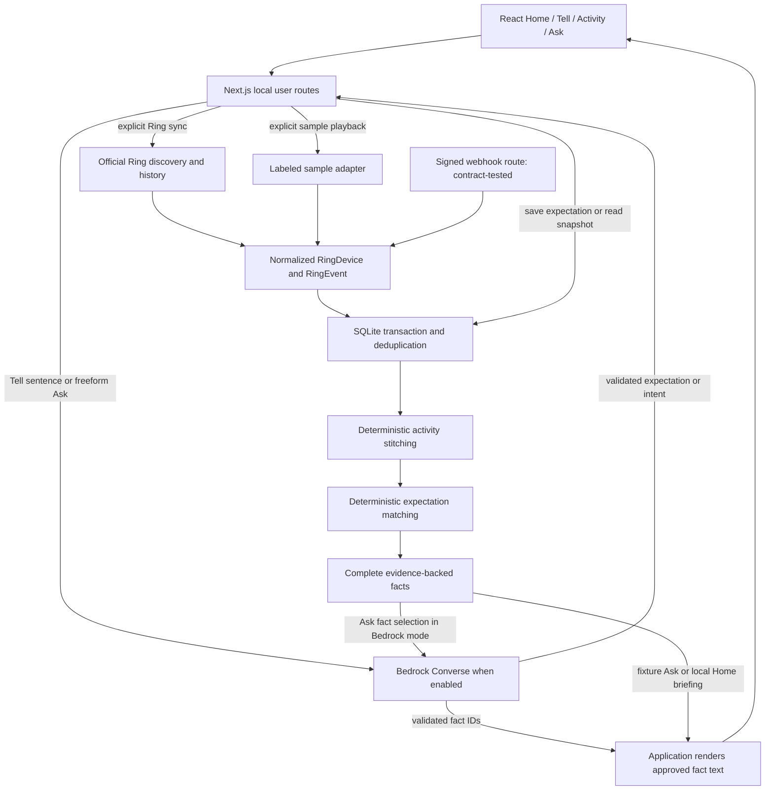

# Around technical architecture and readiness

Around is a local, single-home Next.js application. The implemented product connects expected visits with recorded activity and answers a bounded set of household questions. The positive two-device scenario is sample-validated; real Ring verification currently covers official Playground discovery and live-view history.

## Architecture overview

The Ring and sample branches are explicit modes, not failover. Only one source setup is allowed per database. The webhook route requires authorized HTTPS ingress for external delivery; no ingress or live webhook receipt is part of current verification.

## Components and runtime routes

| Component | Responsibility and entry point |
| --- | --- |
| `src/app/page.tsx` | Source-labeled UI, Tell form, Ask form, activity/expectation cards, refresh and temporary-key controls |
| `POST /api/expectations` | `parseExpectation()` validates language input, optionally calls Bedrock, then `Store.saveExpectation()` persists and rematches |
| `POST /api/ring/sync` | Selects fixture events or `syncRing()` from configured mode, then `Store.ingest()` |
| `POST /api/ring/webhook` | Verifies signature/account/device/schema and ingests without outbound calls |
| `POST /api/ask` | `ask()` interprets a question, builds facts and validates Bedrock selections when enabled |
| `GET /api/state` | Returns devices, activities, expectations and matches; omits raw events; computes the Home briefing locally |
| `src/lib/config.ts`, `time.ts`, `http.ts` | Explicit modes, timezone validation, request/body boundaries and safe errors |

## Data flow from Ring event to answer

1. The user explicitly syncs. In Ring mode, `syncRing()` calls `GET /v1/devices`, then per-device `GET /v1/history/devices/{id}/events` at `https://api.amazonvision.com`.
2. JSON:API resources, device relationships and epoch-millisecond timestamps are validated. `on_demand` becomes `live_view`; supported classified motion and doorbell records normalize to their appropriate event types. Unsupported types are ignored.
3. In configured mode, two distinct authorized directed IDs map to driveway and front door at Home. Dedicated subtype queries supplement generic history. Playground mode expects one discovered device and unfiltered history, with zone `other` and location Ring Playground.
4. After all pages succeed, `Store.ingest()` transactionally deduplicates events, rebuilds activities and rematches expectations. A webhook uses the same store after signature/account validation.
5. Ask reads a snapshot. Application code constructs the statements that the available records support, including uncertainty. Bedrock may select those statements by ID; the application renders their original text and evidence labels.

The app uses Ring REST APIs via `fetch`, not a separate Ring SDK. The Playground is the only live Ring source exercised. Around neither fetches nor analyzes footage. The official Playground player shown in the submission is outside the Around app.

## Database and data model

Node's `DatabaseSync` provides SQLite with foreign keys, WAL journaling and a five-second busy timeout. There is no external database service.

| Table | Stored information |
| --- | --- |
| `RingDevice` | Internal and directed provider IDs, name, type, home label and configured zone |
| `RingEvent` | Provider event ID, device, normalized type, timestamp, raw payload and source |
| `Activity` | Group type, estimated bounds, label, summary, heuristic score, home and source |
| `ActivityEvent` | Links an activity to its underlying events |
| `Expectation` | Original sentence, service/person, date, same-day window, Home and status |
| `ExpectationMatch` | Activity/expectation pair, score and explanation |
| `WebhookReceipt` | Request IDs for idempotent webhook delivery |
| `metadata` | Ring mode/device setup and timezone binding |

A unique device/event pair prevents duplicate insertion. A classified webhook can enrich an existing generic motion event with the same ID. Transactions include rebuilds; failures roll back device, event, receipt and derived-record changes. Saving an expectation also rebuilds matches, so an expectation entered after activity can still match.

## Activity stitching and expectation matching

`stitch()` sorts unique events by timestamp and ID. It groups compatible observations from the same source, named home and local day, within a 60-minute gap and a three-hour total span. Explicit fixture arrival/departure boundaries split groups. Live views remain independent and cannot bridge or extend detections.

A probable visit needs driveway vehicle evidence plus front-door person or doorbell evidence. Its start is the first grouped event. A later final driveway vehicle observation can supply a possible end. A Ring vehicle observation is not itself a directional arrival/departure classification.

`matchExpectations()` matches only probable visits at the expectation's location whose start lies inside its inclusive window. One fitting visit/expectation pair receives a 0.7 heuristic match score; competing pairs fall to 0.4. A visit activity has a 0.75 grouping score. These are application thresholds, not statistical probabilities. A likely match uses the 0.6 threshold and never confirms identity.

The same-home setup and grouping rules can join distinct visits close together. Missing detections can leave a visit unrecognized. No physical tracking or identity recognition is implemented.

## Amazon Bedrock integration

`bedrockJson()` in `src/lib/ai.ts` creates `BedrockRuntimeClient` and sends `ConverseCommand`. Verified runtime used `amazon.nova-micro-v1:0` in `us-east-1`. Model and region remain explicit configuration.

| Flow | Input to Bedrock | Validated output and calls |
| --- | --- | --- |
| Tell | Sentence, today's date, timezone | Service/person, date, start/end, Home; one call |
| Freeform Ask interpretation | Question, today, expectation IDs/services/dates | `visit`, `briefing` or `unsupported`, with an existing expectation ID or null; one call |
| Ask answer selection | Question and complete application-built facts | Up to four unique known IDs, required first fact retained; one call |
| Exact briefing shortcuts | No model interpretation step | Deterministic routing followed by the fact-selection call |
| Home briefing | No Bedrock input | Local `briefingFacts()` only |

A normal freeform question makes two calls. A visit answer currently provides one mandatory fact, so the final selection step does not perform open-ended synthesis. The model never decides how events form a visit. Fixture language supports the documented demo sentence/questions and shortcuts, not general natural-language understanding.

Temporary UI keys use SDK bearer authentication. Without a UI key, the SDK's existing credential chain is used. The app does not create IAM identities or other AWS resources. IAM was used during authorized onboarding to scope demo credentials, not as an application runtime workflow. No AgentCore, Strands, SageMaker, S3 or hosted AWS application is implemented.

## Grounding and error handling

Zod validates text length, provider shapes, parsed expectation fields and selected IDs. Date conversion rejects invalid calendar dates, reversed windows and nonexistent local times. Unknown expectation IDs or unsupported fact IDs fail visibly. The first fact must remain first and whole, preserving its qualified wording. No unconstrained model prose is displayed.

For Ask briefings, today's activities and at most three expectations become facts. Live views are counted separately; absence of activity is not reported as proof that nothing happened. The two explicit commands “Anything I should know?” and “What did Ring record?” bypass model intent classification.

Ring requests have a 12-second timeout per page, disallow redirects and restrict pagination to the official origin. Each query is capped at 20 pages. Bedrock uses one SDK attempt, a 20-second timeout, 12,000 serialized input characters and 600 output tokens. No provider error triggers a fixture fallback. Allowlisted error categories retain useful diagnostics without returning raw provider messages or credentials.

User routes require local Host/origin consistency and bound request bodies to 64,000 bytes. This is a local-use boundary, not user authentication. Webhooks instead use HMAC-SHA256, account binding and configured device checks. No rate limiting, public session system or production perimeter has been implemented.

## Data and credential boundaries

Raw Ring payloads persist locally in SQLite. The browser state API omits raw events, but displays selected activity and device information. Bedrock model input contains entered text, selected expectation fields and facts. It excludes raw Ring payloads, images, video and credentials. An authorized credential is sent separately through SDK authentication.

The Ring input clears before sync and its supplied value is request-only. The Bedrock input stays in React page memory across Tell/Ask calls until Clear or reload. Neither UI credential is saved by application code. Browser password managers are separate and may offer to save inputs. Database files, `.env.local`, raw recordings and local receipts are ignored by Git.

## Fixture mode versus real Playground mode

| Mode | Event source | Language | What it proves |
| --- | --- | --- | --- |
| `demo:sample` | Four explicit sample events, two sample devices | Local exact-demo behavior | Repeatable interface, persistence and domain logic |
| `demo:sample:bedrock` | Same sample events | Actual Bedrock when authorized | Language integration with synthetic activity |
| Ring Playground + fixture AI | Official one-device history when synced | Local answers | Real ingestion with deterministic presentation |
| Ring Playground + Bedrock | Official history | Actual Bedrock when authorized | Provider-grounded language on received records |
| Contract tests | Synthetic provider-shaped payloads | Mocked/intercepted where needed | Implemented contract handling, not live-provider availability |

The approved video is an edited evidence sequence. Its sample answers were generated earlier by Bedrock; no new inference occurred during the Ring capture. Real records total three live views and zero matches. The video includes separate takes and a labeled stored-record still rather than an uninterrupted sync shot.

## Why this is a substantive Ring integration

The official API is called from application routes. Returned IDs and timestamps enter persistent records and influence the actual user answer. New ingestion triggers deterministic rebuilding and expectation matching, rather than remaining an isolated API response or notification.

The implemented two-device pipeline can form a probable service visit and compare it with an expectation. That positive workflow is verified with samples and contract tests. Its live classified-event behavior remains open. The actual Playground path proves an equally important boundary: a camera-view request stays a view request and cannot become a confirmed visit.

The consumer contribution is connecting expected activities to recorded evidence. Delivery confirmation, live multi-camera validation and autonomous home actions are not claimed.

## Why this is a substantive AWS Builder integration

Amazon Bedrock participates in three implemented language roles: expectation parsing, question interpretation and constrained fact selection. The system persists expectations and connects the answer to deterministic event logic, with validation and explicit failure handling. The daily Ask briefing reuses those facts; Home itself remains local.

The actual provider checks covered a parsed window, a dated insufficient-evidence Ring answer, the corrected briefing and a positive sample sequence. This is more integrated than a standalone generated paragraph, but additional call count alone is not proof of novelty. Around does not implement the multi-service or agent-orchestration examples highlighted by the hackathon's quality-of-idea guidance. Judging and awards remain the organizers' decision. [Official criteria](https://amazonappdev2026.devpost.com/rules).

## Testing and production readiness

`npm run check` runs type generation, TypeScript, ESLint and 31 targeted tests. `npm run build` compiles production output. `npm run test:e2e` covers three production browser scenarios with isolated databases and synthetic data. Test files cover grouping, ambiguity, dates, rollback, pagination, HMAC, secret-safe errors, mocked Bedrock authentication and temporary-key lifecycle. See [current results](SUBMISSION-CHECKLIST.md).

Production would need authenticated household isolation, authorized account linking/refresh, webhook infrastructure, retention and deletion controls, operational monitoring, broader device/event validation and user testing. None is silently supplied by the local demo. Free judge evaluation covers the sample; full live-provider access remains a separate unresolved arrangement.
